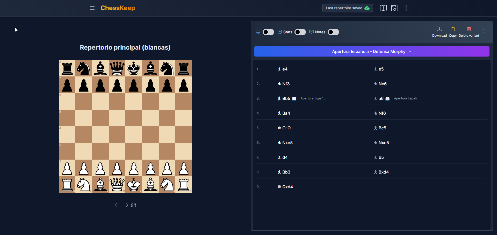
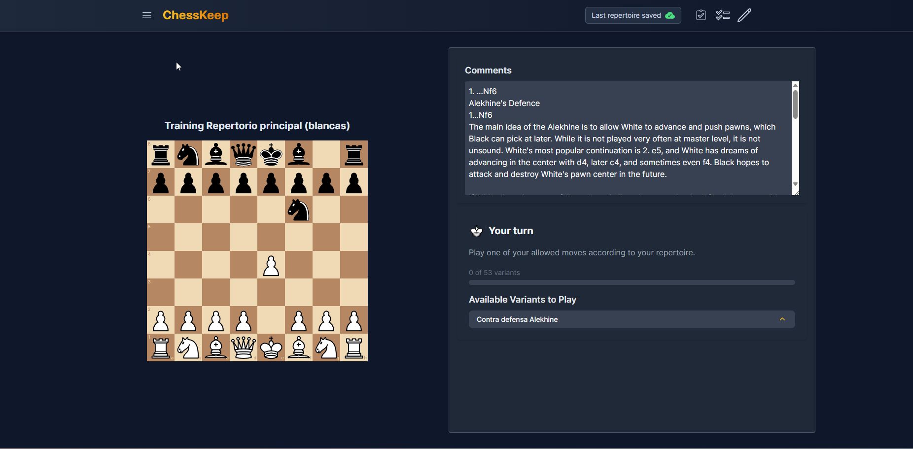

# ChessKeep

<p align="center">
<a href="https://github.com/sky10p/ChessOpeningMaster/blob/master/src/doc/donate/donate.md" alt="Donate shield"></a>
</p>

## Description

ChessKeep is an application that allows you to manage your chess opening repertoire and train all the variations. The application is designed to be easy to use and offers various useful functionalities to enhance your gameplay.

## Features

* Manage repertoires (create, edit, and delete).
* Order repertoires.
* My Games page for games intelligence, sync, imports, and training workflow.
* User authentication with cookie-based sessions.
* Optional default local user access for development or local-only usage.
* User-scoped data isolation across repertoires, studies, positions, and variants info.
* In repertoire editing:
    * Rename names at a specific position (automatic creation of variations).
    * Delete positions.
    * Add comments.
* In repertoire training:
    * View trained variations.
    * Choose which variations to train.
    * View comments.

## User Authentication

ChessKeep supports optional authentication and per-user data isolation.

- Backend flow and rules: [src/doc/User-Auth-Backend.md](src/doc/User-Auth-Backend.md)
- Frontend flow and UX behavior: [src/doc/User-Auth-Frontend.md](src/doc/User-Auth-Frontend.md)

### Auth environment variables

- `ENABLE_AUTH` (`true` to enable auth)
- `ALLOW_DEFAULT_USER` (`true` to allow passwordless local default-user login)
- `DEFAULT_USER_USERNAME` (default user name, default: `default`)
- `DEFAULT_USER_PASSWORD` (default user password if user must be created)
- `AUTH_TOKEN_TTL_SECONDS` (session token expiration in seconds)
- `AUTH_COOKIE_SAME_SITE` (`lax`, `strict`, `none`)

When auth is enabled, frontend displays login/register pages and backend scopes data by `userId` on protected routes.

## PathPage and Next Lesson

The `/path` page is a two-view learning center (`Next lesson` + `Path forecast`) backed by:

- `GET /paths`
- `GET /paths/plan`
- `GET /paths/analytics`

- Full behavior and rules: [src/doc/PathPage-Next-Lesson-Logic.md](src/doc/PathPage-Next-Lesson-Logic.md)
- Category filters (`variantsWithErrors`, `newVariants`, `oldVariants`, `studyToReview`) force deterministic selection.
- Without a category, backend applies deterministic due-first selection with no same-day repeat enforcement.
- Result types returned to frontend are `variant`, `newVariant`, `study`, or an empty message.

## Dashboard Spaced Repetition Insights

Dashboard now includes a dedicated `Path Insights` tab with:

- due-load preview for the next 14 days,
- likely next variants,
- rating distribution (`again/hard/good/easy`),
- openings entering the short-term queue,
- inline metric tooltips for `Overdue`, `Due next 7d`, `Suggested new`, and `New/Day`.

Documentation:

- [src/doc/Dashboard-Spaced-Repetition-Insights.md](src/doc/Dashboard-Spaced-Repetition-Insights.md)

## My Games (Games Intelligence)

The `/games` page is a unified games intelligence workspace with four tabs:

- `Insights`: outcome summary, mapped/manual-review ratios, strongest/weakest variants, off-book signals, monthly activity, and training ideas.
- `Training`: actionable queue and focus lines from imported games + repertoire mapping + training signals.
- `Sync`: linked account management (Lichess/Chess.com), per-provider sync, force-sync-all, and manual PGN import (paste/upload).
- `Data`: imported games browser and deletion operations (single game, filtered batch, full reset).

Current shared filters used across data-driven tabs:
- `source`, `color`, `mapped`, `timeControlBucket`, `dateFrom`, `dateTo`, `openingQuery`.

Behavior highlights:
- On page load, data is fetched for accounts/imports/stats/latest training plan.
- If linked accounts are due, one startup automatic sync pass can run and then rematch + plan regeneration are applied.
- Provider/manual imports and force-sync flows refresh games, stats, and training plan together.
- Marking training items done updates plan status and refreshes training/stat signals.

Games documentation:
- User flow and tab behavior: [src/doc/Game-Imports-Guide.md](src/doc/Game-Imports-Guide.md)
- Backend architecture and orchestration: [src/doc/Game-Import-Service-Architecture.md](src/doc/Game-Import-Service-Architecture.md)
- Queue interpretation and workflow: [src/doc/Training-Queue-Guide.md](src/doc/Training-Queue-Guide.md)
- API/contract spec: [docs/specs/game-imports-openings-training-plan.md](docs/specs/game-imports-openings-training-plan.md)

## Installation Requirements

* Web server such as nginx.
* MongoDB 4.4 or higher

## Installation and Configuration

To install and run ChessKeep on your local environment, follow these steps:

1. Clone the repository to your local machine.
2. Make sure you have Node.js and yarn installed.
3. Run `yarn install` to install the project's dependencies.
4. Set up your web server and MongoDB following specific instructions for your environment.
5. Use the following yarn commands to run the project in development or production mode.

### Configure Nginx

To configure Nginx as a web server for ChessKeep, create a new Nginx configuration file with the following content:

```perl
server {
    listen 3002;
    server_name myapp.local;  # Replace this with your application's domain name, if you have one

    root <chesskeep path>/build/frontend;
    index index.html;

    location / {
        try_files $uri $uri/ /index.html;
    }
}

```

Make sure to replace `<chesskeep path>` with the path to your ChessKeep directory on your server.

Reload the Nginx configuration for the changes to take effect:

```
sudo nginx -t && sudo nginx -s reload
```

## Create a Systemd Service for the backend

To create a Systemd service for the ChessKeep backend, create a new service file at `/etc/systemd/system/chesskeep.service` with the following content:

```makefile
[Unit]
Description=ChessKeep Backend
After=network-online.target
Wants=network-online.target

[Service]
ExecStart=<bin node path> <chesskeep path>/build/backend/server.js
Environment=MONGODB_URI=mongodb://localhost:27017/chess_opening_master
Environment=BACKEND_PORT=3001
Restart=on-failure
Type=simple
User=<user>
Group=nogroup
WorkingDirectory=<chesskeep path>/build

[Install]
WantedBy=multi-user.target

```

Replace `<bin node path>` with the path to your Node.js binary, `<chesskeep path>` with the path to your ChessKeep directory, and `<user>` with the appropriate user to run the service.

Enable and start the service:

```bash
sudo systemctl enable chesskeep.service
sudo systemctl start chesskeep.service
```

To check the status of the service, run:

```lua
sudo systemctl status chesskeep.service
```

## Future improvements

* Allow the creation of arrows and circles on the board with the right mouse button.
* Undo menu when renaming nodes or deleting them (to avoid errors).
* Display analytics of studied variations by day, repetitions, etc.
* Add a spaced repetition system like SM-2 or Anki.
* Allow adding incorrect moves to the repertoire and allowing them during training to recognize your mistakes.
* Option to import/export repertoires (currently from MongoDB).
* Option to import/export in PNG.

## Known issues

The Chessboard library being used is no longer maintained, it will be replace as soon as possible.

## Collaboration

Although ChessKeep was initially created as a personal use tool, any type of collaboration is welcome. If you have ideas for improving the project, feel free to open issues or make pull requests.

## Screenshots




## License

ChessKeep is licensed under a Non-Commercial Free Software License. You may use, modify, and distribute the software in accordance with the terms of this license. However, commercial use of the software requires prior consent from the author. For more information about commercial use, please contact the project author.
